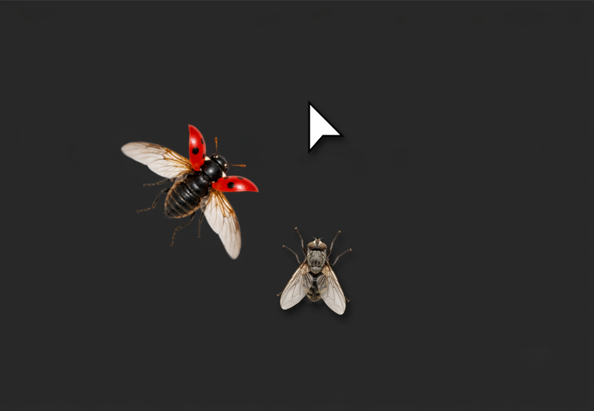

# Ambed Fly

A lightweight animated insect extension for the GNOME desktop.

Ambed Fly brings small, animated insects to your desktop and gives them natural movement and simple interactions with their surroundings.

The extension currently features flies and ladybugs. Each creature moves independently around the desktop, changes direction naturally, reacts to mouse movement, and responds to moving windows.

Ambed Fly is designed to add a subtle sense of life to the desktop while remaining lightweight, simple, and unobtrusive.

## Preview

<p align="center">
  
</p>

## Features

- Animated flies and ladybugs
- Independent creature movement
- Multiple animation frames
- Natural wandering behavior
- Smooth direction changes
- Mouse interaction
- Reaction to moving windows
- Fly and ladybug movement behavior
- Choose which insects appear on the desktop
- Display flies only
- Display ladybugs only
- Display both insects
- Choose the number of insects
- Support for 1 to 6 insects
- Simple preferences window
- Lightweight desktop integration
- No external services required

## Settings

Ambed Fly includes a preferences window that lets you control the insects displayed on your desktop.

### Creature Type

Choose between:

- Fly only
- Ladybug only
- Both

### Creature Count

Choose how many insects appear on the desktop.

You can display between 1 and 6 insects at the same time.

The default configuration displays one fly.

## Version 2

Version 2 expands Ambed Fly beyond the original animated fly.

The first version introduced a lightweight animated fly that wandered around the GNOME desktop and reacted to mouse movement.

Version 2 introduces multiple insect types and configurable creature behavior, including:

- Ladybug support
- Fly and ladybug selection
- Mixed insect mode
- Configurable creature count
- Support for up to 6 creatures
- Independent movement between creatures
- Creature collision handling
- Improved interaction with the mouse
- Interaction with moving windows
- A dedicated preferences window

## Compatibility

Ambed Fly supports GNOME Shell 45 and later.

It is designed to work across Linux distributions using supported GNOME Shell versions.

## Installation

### GNOME Extensions

Ambed Fly is available on the official GNOME Extensions website.

Open GNOME Extensions and search for:

`Ambed Fly`

Then open the extension page and enable it.

GNOME Extensions handles the installation and future updates automatically.

### Manual Installation

Manual installation is also available for users who prefer installing the extension directly from the source repository.

#### 1. Clone the repository

Open a terminal and run:

```bash
git clone https://github.com/walid-rouibah/ambed-fly.git
